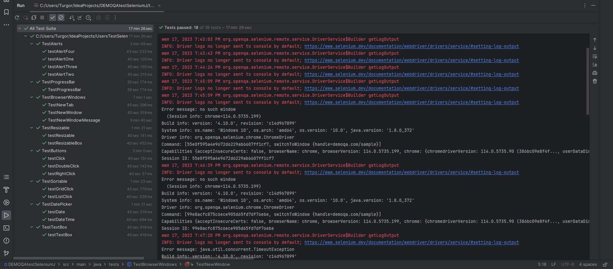
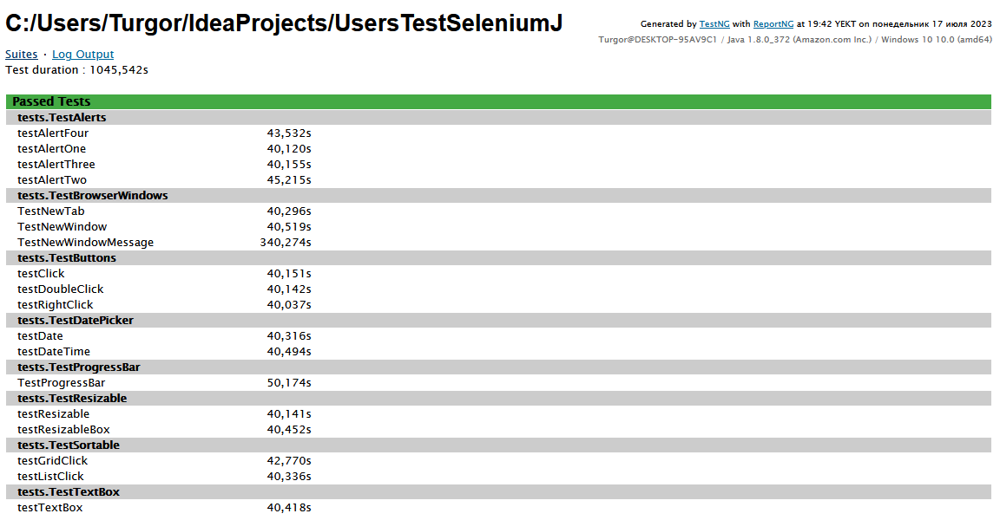
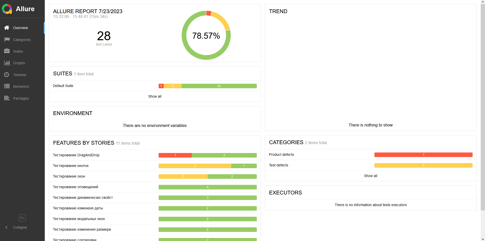
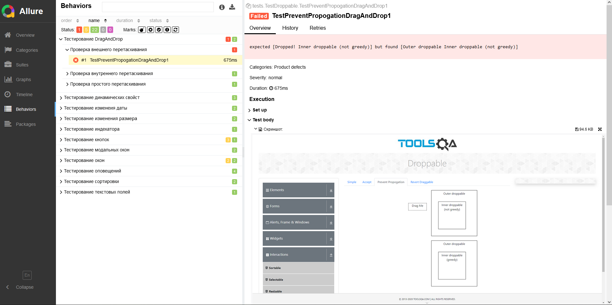

#  UsersTestSelemium

### Описание

Цель проекта: получение навыков в написание автоматизированных авто тестов на Java. 
Сайт для тестирования (<a href="https://demoqa.com/">DEMOQA</a>).

## Технологии

- Java
- Selenium
- TestNG
- Allure

## Окружение

Для запуска тестов нужно установить <a href="https://www.google.com/intl/ru_ru/chrome/">Google Chrome</a>

## Selenium тесты

Пример запуска Selenium тестов (TestNG):

Report Selenium (TestNG)

Report Selenium (Allure)

